# module 05 协程调度模块

## 5.1 协程调度器的工作原理

当你有很多协程时，如何把这些协程都消耗掉，这就是协程调度。

在前面的协程模块中，对于每个协程，都需要用户手动调用协程的resume方法将协程运行起来，然后等协程运行结束并返回，再运行下一个协程。这种运行协程的方式其实是用户自己在挑选协程执行，相当于用户在充当调度器，显然不够灵活.

引入协程调度后，则可以先创建一个协程调度器，然后把这些要调度的协程传递给调度器，由调度器负责把这些协程一个一个消耗掉。

从某种程度来看，协程调度其实非常简单，简单到用下面的代码就可以实现一个调度器，这个调度器可以添加调度任务，运行调度任务，并且还是完全公平调度的，先添加的任务先执行，后添加的任务后执行。

``` cpp
class Scheduler 
{
public:
    void schedule(std::shared_ptr<Fiber> task) 
    {
        m_tasks.push_back(task);
    }

    void run() 
    {
        std::shared_ptr<Fiber> task;
        auto it = m_tasks.begin();
 
        while(it != m_tasks.end()) 
        {
            task = *it;
            m_tasks.erase(it++);
            task->resume();
        }
    }

private:
    std::list<std::shared_ptr<Fiber>> m_tasks;
};
 
void test_fiber(int i) 
{
    std::cout << "hello world " << i << std::endl;
}
 
int main() 
{
    // 初始化当前线程的主协程
    Fiber::GetThis();
 
    // 创建调度器
    Scheduler sc;
 
    // 添加调度任务
    for(auto i = 0; i < 10; i++) 
    {
        std::shared_ptr<Fiber> fiber(new Fiber(std::bind(test_fiber, i)));
        sc.schedule(fiber);
    }
    sc.run();

    return 0;
}
```

## 5.2 协程调度器类

### 5.2.1 多线程调度

一个线程同一时刻只能运行一个协程，所以，作为协程调度器，势必要用到多线程来提高调度的效率，因为有多个线程就意味着有多个协程可以同时执行，这显然是要好过单线程的。

这里可以简单地认为，调度器创建后，内部首先会创建一个调度线程池，调度开始后，所有调度线程按顺序从任务队列里取任务执行，调度线程数越多，能够同时调度的任务也就越多，当所有任务都调度完后，调度线程就停下来等新的任务进来。

添加调度任务的本质就是往调度器的任务队列里塞任务，但是，只添加调度任务是不够的，还应该有一种方式用于通知调度线程有新的任务加进来了，因为调度线程并不一定知道有新任务进来了。当然调度线程也可以不停地轮询有没有新任务，但是这样CPU占用率会很高。

### 5.2.2 调度器结构

调度器内部维护一个任务队列和一个调度线程池。开始调度后，线程池从任务队列里按顺序取任务执行。当全部任务都执行完了，线程池停止调度，等新的任务进来。添加新任务后，通知线程池有新的任务进来了，线程池重新开始运行调度。停止调度时，各调度线程退出，调度器停止工作。

``` cpp
private:
    // task list
    std::list<std::shared_ptr<fiber::Fiber>> m_tasks;
    // mutex to lock private members
    MutexType m_mutex;
    // threads pool
    std::vector<std::shared_ptr<thread::Thread>> m_threads;

    std::string m_name;
```

将函数看做一个任务也是可行的，只需要为该函数创建一个执行协程。`ScheduleTask`的定义如下：
``` cpp
struct ScheduleTask
{
    std::shared_ptr<fiber::Fiber> m_fiber;
    std::function<void()> m_cb;
    // record the thread that runs the fiber/function
    int m_threadId;

    ScheduleTask();
    ScheduleTask(std::shared_ptr<fiber::Fiber> f, int thr = -1);
    ScheduleTask(std::function<void()> f, int thr = -1);

    void reset() { m_fiber = nullptr; m_cb = nullptr; m_threadId = -1; }
};
```

将一个任务加入调度队列中，协程调度器就应该最后执行它。在此之前，协程调度器应构造一个线程池，将调度任务分配个各个线程进行执行。

### 5.2.3 调度器的执行

在`start()`方法中，调度器初始化线程池。
``` cpp
void Scheduler::start()
{
    m_threads.resize(m_threadCount);
    for (size_t i = 0; i < m_threadCount; i++)
    {
        m_threads[i].reset(new thread::Thread(std::bind(&Scheduler::run, this), m_name + "_" + std::to_string(i)));
    }
}
```

对每个线程，为其分配调度任务。方法是设置线程的执行入口为`Scheduler::run()`函数。正如之前看到的，在执行入口中，需要先执行`getThis()`初始化线程主协程，然后每个线程从任务队列中取得任务`task`，使用`task->resume()`执行协程。整个过程如下图所示。



可以看到，main函数的主协程`t_threadFiber`仅仅负责向调度器中添加任务，而由线程池中的各个线程进行调度。

一个问题是各个线程如何知道调度队列中还有任务？在该实现中，每个线程检测到调度队列无任务时，直接`break`结束线程并释放资源。事实上，可以将其改为`continue`不断轮询调度队列，但将占用大量CPU资源。更好的方式是当`main`函数中加入任务时，通知各个调度线程。若线程检测到调度任务空，不退出线程，而是等待被`main()`函数唤醒。

在主程序的最后，应当使各个线程执行完毕后再结束调度器的运行。

``` cpp
void Scheduler::stop()
{
    std::vector<std::shared_ptr<thread::Thread>> thrs;
    {
        thread::ScopedLock<MutexType> lock(m_mutex);
        thrs.swap(m_threads);
    }
    for (auto &i : thrs)
    {
        i->join();
    }
}
```

### 5.2.4 idle协程

刚才提到的问题在于一个线程检测到无调度任务时直接退出执行。为了能够让main()函数不断添加任务，同时线程不断检测任务并执行，我们需要添加一个`idle()`协程任务，当线程检测到任务队列空时执行`idle()`协程。`idle`协程检测停止命令，收到停止命令时则不`yield`而是直接结束。

``` cpp
void Scheduler::idle()
{
    while (!m_stopCommand)
    {
        fiber::Fiber::getThis()->yield();
    }
}
```

在`run()`函数中，当任务队列为空时，执行`idle`协程。
``` cpp
if (!task)
{
    idleFiber->setIdle();
    idleFiber->resume();
    continue;
}
```